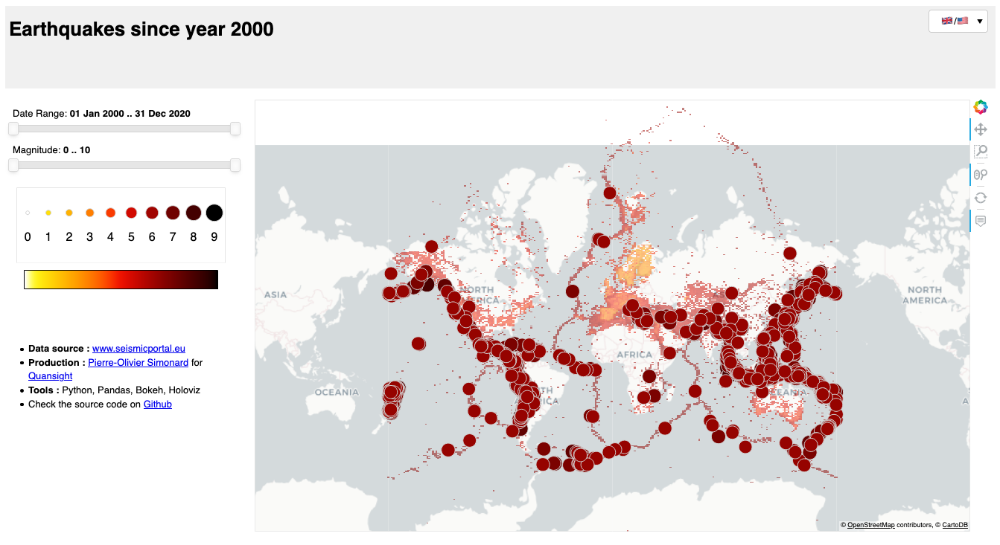

# Earthquakes 
A dashboard to visualise earthquakes worldwide since 2000. 

Basically just a fixed-in-time, working copy of my repository : [https://github.com/pierrotsmnrd/earthquakes](pierrotsmnrd/earthquakes)




## Key points

- Displays **140MB of data** for more than **950.000 earthquakes** since 2020
- Offers translation in **two languages**
- Runs **outside Jupyter** 


## Run

This dashboard is served trough ```panel.serve()``` and runs in a docker container : 
```
./docker/run.sh -d 
```

##  Data 
 
- The dataset represents earthquakes from 2000, Jan. 1st to 2021, May 25th.  
- The data in my repository are updated automatically with Github's FlatAction. Import the data from there if you want to be up to date.


## Dashboard

The dashboard is made with Holoviz (using Holoviews, Geoviews and Panel) with the Bokeh backend.

It relies on pandas to load the data.


## Thanks

Thanks to @kcpevey and @tonyfast for their help and encouragements.