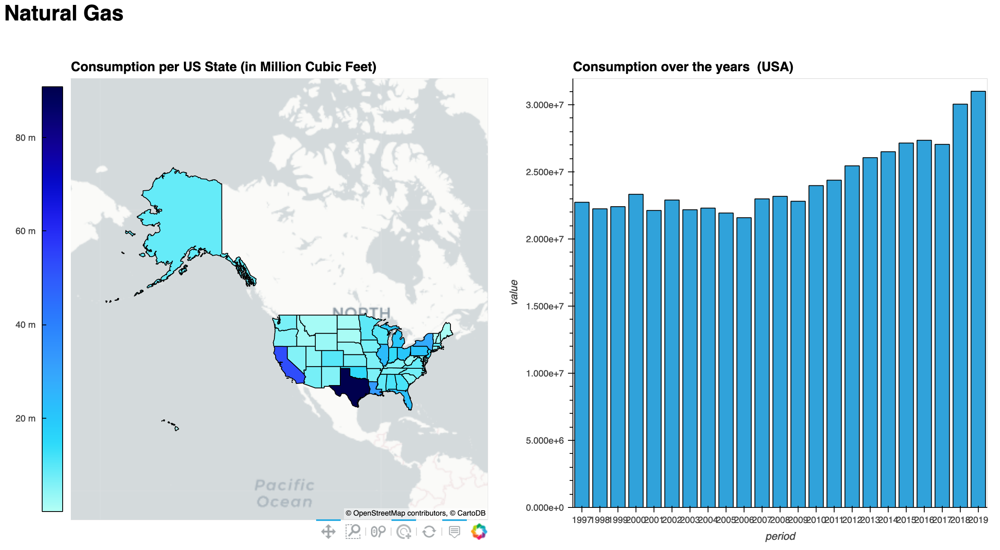

# US Natural Gas Dashboard




## Goal

Demonstrate a simple clickable dashboard with geographical data over time


## Packages

- Viz Stack : Holoviz ( holoviews, geoviews, panel)
- Data Stack : pandas, geopandas

## Data

check the [data readme](data/README.md)


## How to run :

```
conda env create -f environment.yml
conda activate us_natural_gas
jupyter labextension install @pyviz/jupyterlab_pyviz      
jupyter lab --ServerApp.token=""  
````

then open [dashboard.ipynb](dashboard.ipynb)

